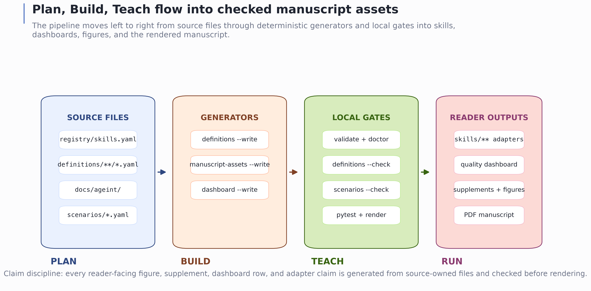
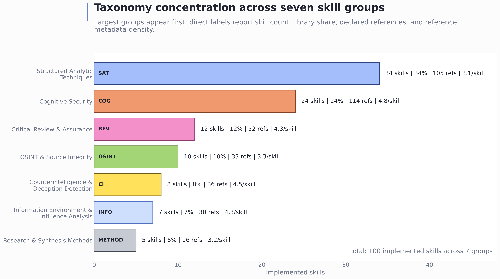

# Source Boundary and the Harness-Neutral Skill Contract {#sec:system_context}

## Repository-Local Evidence Boundary

CogSecSkills is a defensive skills library, not a live influence system, benchmark suite, or external claim engine. Its authoritative inputs are plain-text project files: the registry declares the catalogue, canonical definitions own skill substance and quality controls, rendered skill directories expose harness-facing interfaces, AGEINT documents provide the teaching context, and the Python package validates and reports on the library. The manuscript describes those local surfaces and the gates that keep them synchronized.

## Plan/Build/Teach Source Surfaces

The project uses three mutually reinforcing surfaces:

| Surface | Role | Reader question |
| --- | --- | --- |
| `registry/skills.yaml` and `registry/groups.yaml` | Plan | What skills and groups are supposed to exist? |
| `definitions/<group>/<slug>.yaml` | Build source | What does the skill do, when should it be used, and what defensive quality controls must it carry? |
| `skills/<group>/<slug>/` | Build output | What is actually rendered, and how does each skill bind to harnesses? |
| `docs/ageint/` | Teach | Which AGEINT topic or educational frame motivates the skill? |
| `src/cogsecskills/` | Verify and render | Which checks, reports, routes, and manuscript assets are generated from the source surfaces? |
| `tests/` | Regression contract | Which behaviors are guarded against drift? |

{#fig:plan-build-teach-flow width=100%}

## Harness-Neutral Skill Specification

Each implemented skill declares a small, inspectable contract:

- identity fields: `id`, `name`, `group`, `status`, `version`, `summary`, and `ageint_topic`;
- routing fields: `tags` and `triggers`;
- capability fields: a closed set of tool verbs with purposes;
- interface fields: structured inputs and outputs;
- adapter fields: one harness adapter path per configured harness.

The default harness adapters translate the neutral verbs into Claude, Codex, and Hermes idioms while preserving the same workflow. The same contract also applies to any additional harness configured in `cogsecskills.yaml`. This keeps the library portable in the structural sense: a skill can be evaluated for conformance without executing any external service.

For Codex and Hermes use, this means the adapter text is not a separate source of truth. It is a harness-facing binding layer that must list the same neutral verbs declared by the skill specification. If a skill declares `read`, `reason`, and `write`, each configured harness adapter must show how those verbs are realized in that harness. This is the smallest contract that makes the skill portable while still leaving each runtime free to express its own operational idiom.

This contract is deliberately narrower than a general agent framework. ReAct-style work shows why reasoning and action are often interleaved, and Toolformer-style work shows why model interfaces to external tools matter [@yao2022react; @schick2023toolformer]. CogSecSkills does not attempt to train or evaluate a model to choose tools. It fixes a defensive, inspectable vocabulary of tool verbs and requires every configured harness adapter to bind that vocabulary before the skill is treated as conforming. The contribution is the validated interface layer: source-owned skill substance, closed neutral capabilities, harness-specific bindings, and local drift checks.

## Harness Profile Classes

The harness profile layer is descriptive, not executable. It records named external runtimes and framework families that a reader might target after cloning the repository, but the validation contract remains controlled only by the configured harness set. In this manuscript, **default adapters** means the committed `claude`, `codex`, and `hermes` adapters. **Configured structural adapters** means any harness id placed in `cogsecskills.yaml`, regenerated into every skill folder, and checked by `validate`. **Documented external profiles** means optional metadata rows in `registry/harness_profiles.yaml`; those rows do not certify live runtime behavior, connector safety, vendor support, or field outcomes. The profiles are not one standard: Gemini CLI context files, Copilot instruction and agent surfaces, Cursor/Cline-style rule systems, SDK frameworks, and MCP tool hosts each require product-specific review before use.

| Profile id | Class | How to read it |
|---|---|---|
| `gemini_cli` | terminal agent | Candidate for a Gemini CLI-style local harness using product-specific context files after configuration and adapter review. |
| `github_copilot` | IDE or cloud agent | Candidate for Copilot repository, path-specific, agent, CLI, cloud-agent, or review surfaces whose support varies by product mode. |
| `devin_local` | local agent | Candidate for local-agent use with permissions, sandboxing, skills, and MCP controls. |
| `devin_cascade` | IDE agent | Candidate for Cascade/Devin Desktop AGENTS.md and rules surfaces. |
| `cursor` | IDE agent | Candidate for Cursor rules or skill-style context. |
| `cline` | IDE agent | Candidate for Cline- or Roo-style rule/skill surfaces and configured tool permissions. |
| `aider` | terminal agent | Candidate for read-only skill and convention files in a terminal pair-programming workflow. |
| `continue` | IDE or CLI agent | Candidate for Continue Agent, Chat, or Edit rule contexts. |
| `jetbrains_ai` | IDE agent | Candidate for JetBrains AI Assistant instruction files. |
| `openai_agents_sdk` | programmatic runtime | Application-owned wrapper target with tools, approvals, guardrails, and state. |
| `langgraph` | programmatic runtime | Graph-node and state-machine integration target. |
| `microsoft_agent_framework` | programmatic runtime | Agent or workflow integration target for .NET and Python applications. |
| `autogen` | programmatic runtime | AgentChat/Core integration target. |
| `crewai` | programmatic runtime | Crew, task, flow, and guardrail integration target. |
| `pydantic_ai` | programmatic runtime | Typed agent and capability integration target. |
| `mcp_host` | protocol host | Tool and context transport profile, not a standalone model harness. |
| `perplexity_research` | research companion | Research-support profile unless wrapped by a local tool-executing application. |

## Formal Conformance Contract

Let the closed neutral verb vocabulary be

\begin{equation}
\label{eq:tool-verb-set}
V := \{\mathtt{read}, \mathtt{search}, \mathtt{write}, \mathtt{exec}, \mathtt{reason}, \mathtt{web}, \mathtt{delegate}, \mathtt{ask}\}.
\end{equation}

Let the default harness set be

\begin{equation}
\label{eq:default-harness-set}
H_0 := \{\mathtt{claude}, \mathtt{codex}, \mathtt{hermes}\}.
\end{equation}

Let the configured harness set be

\begin{equation}
\label{eq:configured-harness-set}
H_{\mathrm{cfg}} := \operatorname{harnesses}(\mathtt{cogsecskills.yaml})\quad\text{with default }H_0.
\end{equation}

For each implemented skill `s` in set `S`, the source specification can be read as

\begin{equation}
\label{eq:skill-spec-tuple}
s = (id_s, name_s, group_s, status_s, version_s, summary_s, topic_s, tags_s, triggers_s, V_s, I_s, O_s, refs_s, Q_s, wf_s, A_s)
\end{equation}

subject to

\begin{equation}
\label{eq:skill-conformance}
V_s \subseteq V,\qquad \operatorname{dom}(A_s)=H_{\mathrm{cfg}},\qquad \forall h \in H_{\mathrm{cfg}}:\ V_s \subseteq B_{s,h}.
\end{equation}

Here `I_s` and `O_s` are the declared input and output schemas, `refs_s` is the per-skill metadata reference set, `Q_s` is the required quality-control bundle, `wf_s` is the workflow path, `A_s` maps each configured harness to exactly one adapter path, and `B_s,h` is the set of neutral verbs bound in harness `h` adapter table. Conformance consists of schema validity, registry-to-folder agreement, allowed-verb membership, required quality fields, workflow presence, adapter-path completeness for every harness in `H_cfg`, and adapter binding coverage for every declared verb in `V_s`.

| Field family | Source field(s) | Constraint |
|---|---|---|
| Identity | `id`, `name`, `group`, `status`, `version` | `id` must match `group.slug`; implemented skills must exist on disk. |
| Routing | `tags`, `triggers`, `ageint_topic` | Used for navigation and AGEINT crosswalks, not empirical routing claims. |
| Capability | `tools[*].verb` | Every verb must be a member of `V`. |
| Interface | `inputs`, `outputs` | Names and descriptions must be declared in `skill.yaml`. |
| Provenance metadata | `refs` | Declared skill references; not the same as manuscript citation keys. |
| Quality controls | `defensive_boundary`, `misuse_redirect`, `evidence_requirements`, `confidence_rubric`, `uncertainty_handling`, `privacy_legal_constraints`, `failure_modes`, `negative_controls` | Required by canonical definitions and surfaced in rendered skill files. |
| Harness mapping | `harness` | Every harness in `H_cfg` must resolve to an adapter file whose first-column binding table covers `V_s`. |

## Figure Guide and 100-Skill Taxonomy Snapshot

The manuscript figures are organized from overview to contract detail. The current registry groups the 100 implemented skills into seven taxonomy groups. Those groups are not claimed to be a complete or mutually exclusive theory of cognitive security; they are a defensive coverage map spanning information disorder, source integrity, deception and counterintelligence, structured analysis, research synthesis, and information-environment coordination [@wardleDerakhshan2017informationDisorder; @ukmod2023jdp200; @lazer2018fakeNews; @ferrara2016socialBots; @bradshawHoward2019globalDisinformation]. The taxonomy count chart answers "how much of the library is in each group?" The skill grid answers "can I see all 100 areas at once?" The verb heatmap answers "which groups use which neutral capabilities?" The AGEINT crosswalk answers "which teaching topics motivate which implementation groups?" The Reference Density figure answers "where is declared source backing deepest?" The Harness Contract figure answers "does every group maintain adapter coverage for the configured harness set?" The flow figure ties those views back to the source surfaces and gates. The count and grid figures below are generated from the same ordered registry rows used by the supplemental catalogue, so the visual order and group membership remain synchronized with the source tree.

{#fig:taxonomy-counts width=100%}

{#fig:skill-grid width=100%}
